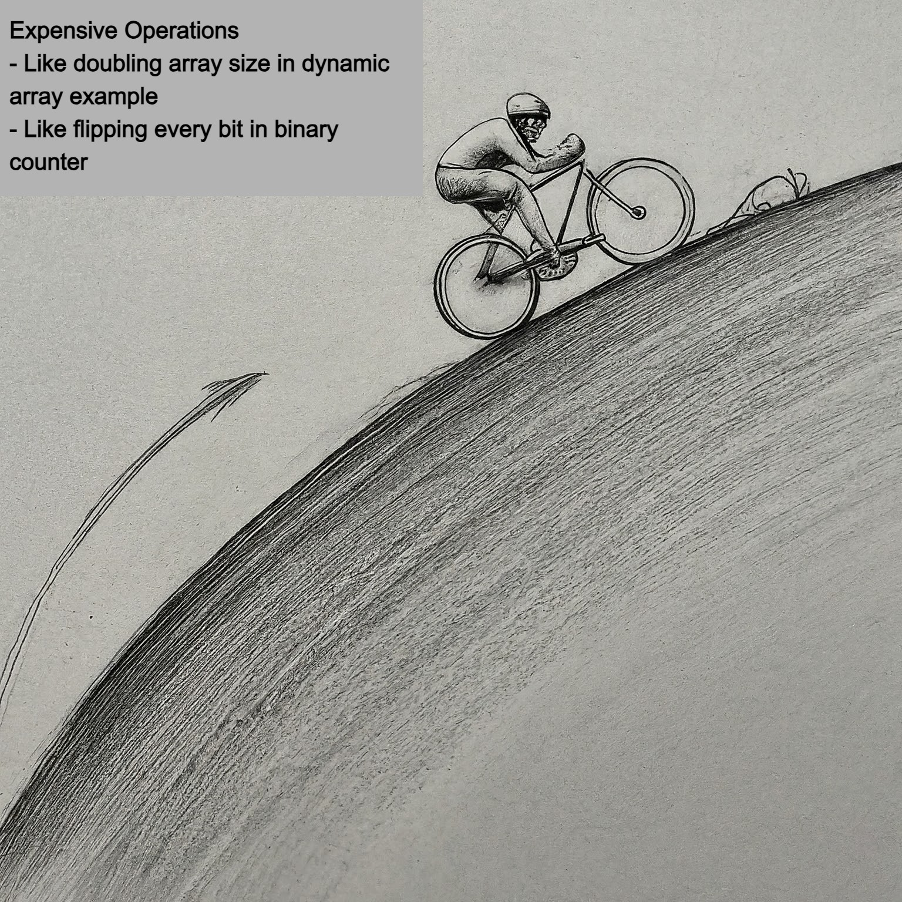
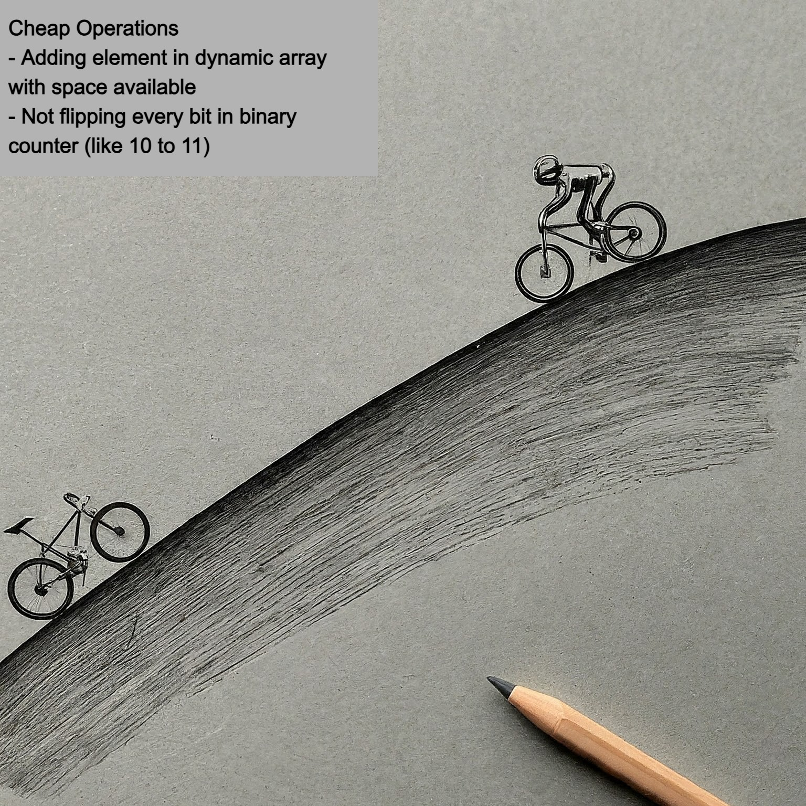
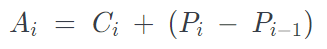
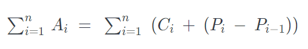
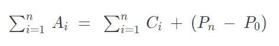

## Amortized Analysis using the Potential Method: Bicycle on a Hill Analogy

#### Imagine you're riding a bicycle up a hill, and your goal is to analyze how much energy (or effort) you use on average over the entire ride, including going both up and down.

### Analogy:
- **Effort Up the Hill (Building Potential)**: As you pedal uphill, you put in a lot of effort. You're building **potential energy** because the higher you go, the more energy you've stored.

- **Effort Down the Hill (Using Potential)**: When you go downhill, you don't need to pedal as much. You use the **potential energy** you've built while going up to coast down the hill, making the ride easier.

| UpHill (Building Potential)                                                                          | DownHill (Using Potential)                                                                           |
|------------------------------------------------------------------------------------------------------|------------------------------------------------------------------------------------------------------|
|  |  |

### Relating to the **Potential Method**:
1. **Potential Energy**: In amortized analysis, the **potential** represents energy stored (or effort saved). You build it up during operations that require more work (going uphill).

2. **Payoff with Less Effort**: When you reach easier operations (like going downhill), you use the built-up potential, reducing the effort needed for those operations.

### Example:
- **Uphill (Expensive Operation)**: Imagine a dynamic array that occasionally needs to resize. The resizing is like going uphill—it takes extra effort (copying all elements to a bigger array). This is when potential is being built.

- **Downhill (Cheap Operation)**: Most `append` operations are cheap like coasting downhill because there's no need to resize the array. Here, you're using the potential you've built earlier.

### Amortized Cost:
- Over time, even though some operations (like resizing) are expensive (like going uphill), most operations are cheap (like going downhill).
- The **amortized cost** is the average effort per operation, which is low, because the potential (energy) built during expensive operations is "spread out" over many cheap ones. Just like your overall effort during the entire ride is lower, even though some parts were tough.

#### All in all, amortized analysis (potential method) is about balancing the tough parts (building potential) with the easy parts (using potential), leading to an overall smooth and efficient ride!

___

### Mathematical Expression using the Potential Method

Let:
- **Ci**: Actual cost of the i-th operation.
- **Ai**: Amortized cost of the i-th operation (what we want to compute).
- **Pi**: Potential function after the i-th operation.
- **Pi-1**: Potential function after the (i-1)-th operation.

### Amortized Cost Formula:

The amortized cost **Ai** is expressed as:

Here, **Ai** depends on:
- **Ci**, the actual cost of the operation.
- **(Pi - Pi-1)**, the change in potential from state i-1 to state i. This reflects whether the operation increases or decreases the stored "energy" in the system.

### Total Amortized Cost for n Operations:

The total amortized cost over n operations is the sum of the amortized costs for each operation:

This simplifies to:

- **Pn**: The potential after the n-th operation.
- **P0**: The potential at the start (typically **P0 = 0**).

### Interpretation:

- If **Pn - P0** is small or bounded, the total amortized cost is close to the total actual cost.
- The change in potential **(Pi - Pi-1)** allows us to "spread out" the cost of expensive operations (e.g., resizing an array) over many cheaper operations, leading to a lower average (amortized) cost per operation.

___ 

### Example: Analysing [Dynamic Resizing Array](https://github.com/AKR-2803/CSE-551-Foundations-Of-Algorithms/blob/main/Modules/module3/01-amortized-analysis-aggregate.md#amortized-time-calculation-example-with-dynamic-array) using Potential Method

- Define the **potential function** **Pi** as the number of extra spaces available in the array after the i-th operation.
- When the array is resized, the potential **Pi** increases significantly because many extra spaces are created, which will be used in future operations.

That means the expensive operation of resizing is "amortized" over many subsequent cheap operations where no resizing is needed, keeping the overall amortized cost **Ai** close to **O(1)** on average.
