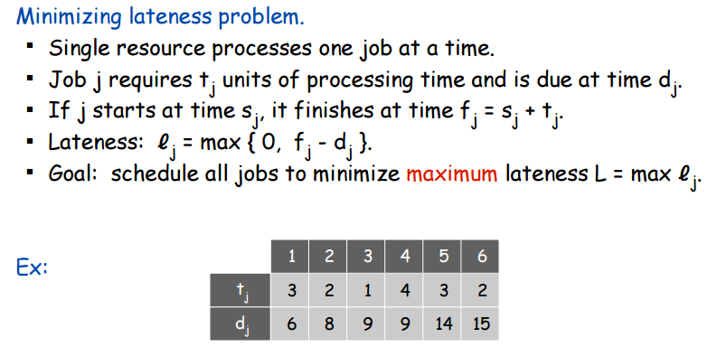
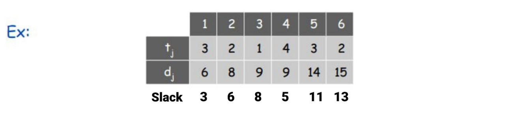
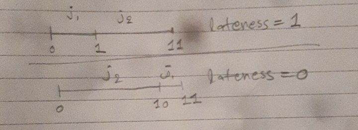
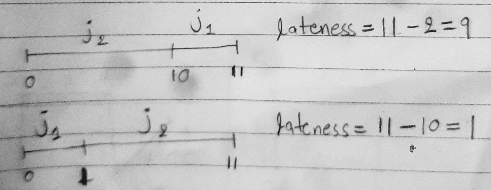

## Scheduling to Minimize Lateness

#### Algorithm used to minimize lateness when a single resource processes one job at a time.

| Problem                                                                                                 | 
|---------------------------------------------------------------------------------------------------------| 
|  |
[Image Source](https://stumash.github.io/Algorithm_Notes/greedy/intervals/min_late.png)

### Notations
- tj: time taken by job `j` to complete
- dj: due time of job `j`
- sj: start time of job `j`
- fj: finish time of job `j`
___
### What is **lj = max(0, fj - dj)**?

- Lateness is how much the job finishes later than its due time.
- Case I: Job finished before the due time
  - If a job had due time dj = 8, but finished at fj = 2, lateness `l = 2 - 8 = -6`. This negative value means the job finished within the due time, so `l = 0`.
- Case II: Job finished after the due time
  - If a job had due time dj = 8, but finished at fj = 11, lateness `l = 11 - 8 = 3`. The job was 3 units late, so lateness `l = 3`.
- Therefore, to handle both cases concisely, we use lj = max(0, fj - dj).
  - If the difference is negative (Case I), `l = max(0, negative_value) = 0`
  - If the difference is positive (Case II), `l = max(0, positive_value) = positive_value`
___
### Our aim is to minimize lateness. Let's brainstorm.
- Clearly, allocating jobs randomly won't help. We need some criteria to order the jobs.
- What criteria should we set?
- We have two factors: time taken and due time.
- Maybe, we can use these two criteria to order the jobs:
  - **Criteria 1**: by time taken [priority to the job that takes less time tj]
  - **Criteria 2**: by deadline [priority to the job with the earliest deadline dj]
- Another factor we can consider is the difference between due time dj and time taken tj, called "slack time".
- SLACK TIME: The time a job can wait without being late.
- For example, **Job-2** has tj = 8, dj = 2. `Slack time = 8 - 2 = 6`. This means Job-2 can wait until time `t = 6` before being scheduled without incurring lateness.
- Slack time can be another criterion to order jobs:
  - **Criteria 3**: by slack time [priority to the job with less slack time]

| Slack Times for Example                                                                                   | 
|-----------------------------------------------------------------------------------------------------------| 
|  |

___

### Checking Criteria 1: By Time Taken

The following counterexample shows that this approach fails. If we prioritize time taken, we get:

|                | 1   | 2   |
|----------------|-----|-----|
| tj  | 1   | 10  |
| dj  | 100 | 10  |

| `l = 1` for Criteria 1, but it could have been better, i.e. `l = 0`                                       | 
|-----------------------------------------------------------------------------------------------------------| 
|  |

___
### Checking Criteria 3: By Slack Time

The following counterexample shows that this approach fails. If we prioritize slack time, we get:

|                | 1 | 2   |
|----------------|---|-----|
| tj  | 1 | 10  |
| dj  | 2 | 10  |

| `l = 11` for Criteria 3, but it could have been better, i.e. `l = 2`                                      | 
|-----------------------------------------------------------------------------------------------------------| 
|  |

___
### Checking Criteria 2: By Due Time

- This approach works best because it prioritizes due time, the main factor responsible for lateness.
- Running the previous examples with this criterion will yield optimal results.
- By addressing due time early, we can minimize overall lateness.
- However, be cautious: while this greedy approach seems reasonable locally, it may not always guarantee a globally optimal solution!
