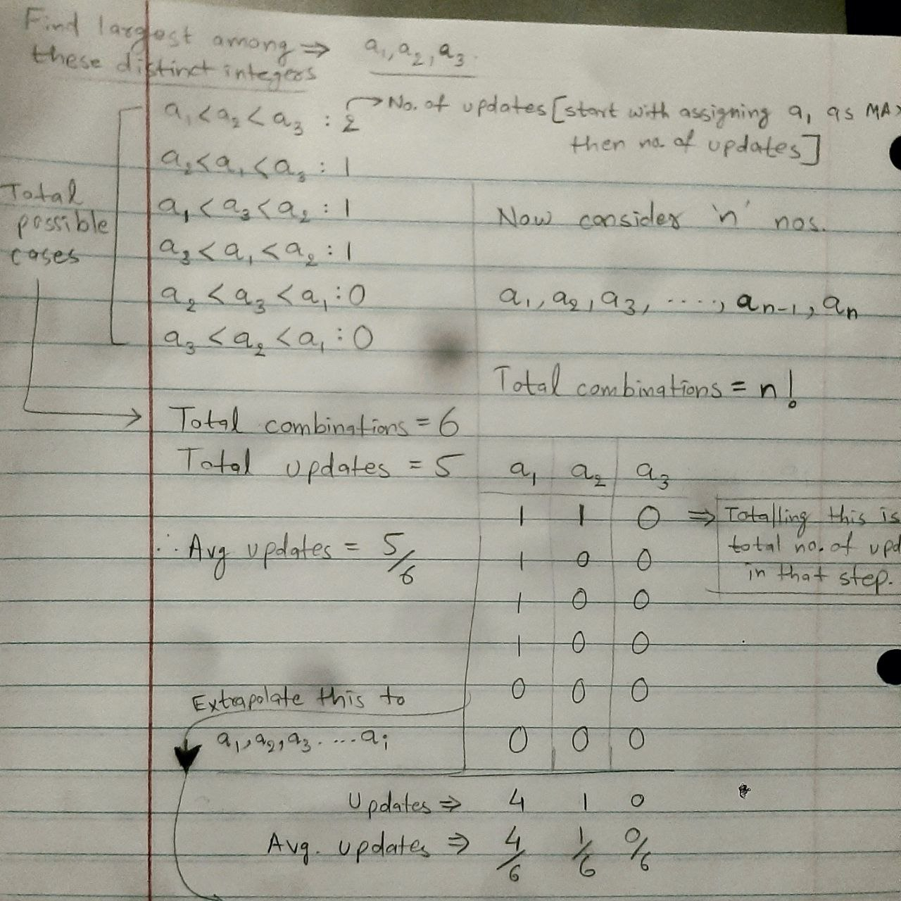

### Cost vs Quality

- A Best solution => Goodness of the algorithm

- Search Space: T1, T2....T(n^(n-2)) => Very Large
- How to find MST
    - Linear Search: very high computational cost 
    - What is a better algorithm? The solution is good if we reduce search space. Find the spaces where the solution might not lie. After reducing search space significantly, which results in less computational cost.
    - This is precisely what Kruskal's algo is doing.
    - A trick to design a good algo is in finding ways that significantly reduce "search space", which has a huge improvement in the computational cost.
    - The quality(i.e. error in the process) of a linear search(zero error) might be better than Kruskal's but the cost is significantly larger.
    - Hence the tradeoff b/w quality and cost has to be considered.

#### Evaluating Quality of Algorithms

- What metric(s) should be considered to measure the "goodness" of an algorithm?
    - Time
    - Space
    - Maybe Power(nowadays?)
- Earlier, the space in computer systems were limited, hence the solutions then were focused more towards that part.
- Embedded systems need to have mechanisms to limit the power.

#### Measuring efficiency of Algorithms

- Table containing times for n,  n2, n3,  n4,  n5, 2^n, 3^n

- Time taken in Complexity vs No. of Operations
- Let us consider it takes 0.0001 seconds for 10 operations in O(n) complexity algorithm.

|  | 10            | 20           | 30           | 40           | 50              |
|------------|---------------|--------------|--------------|--------------|-----------------|
| O(n)       | 0.0001 sec    | 0.0002 sec   | 0.0003 sec   | 0.0004 sec   | 0.0005 sec      |
| O(n²)      | 0.0100 sec    | 0.0800 sec   | 0.2700 sec   | 0.6400 sec   | 1.2500 sec      |
| O(n³)      | 0.1000 sec    | 1.6000 sec   | 8.1000 sec   | 25.6000 sec  | 1.04 min        |
| O(n⁴)      | 1.0000 sec    | 32.0000 sec  | 4.05 min     | 17.07 min    | 52.08 min       |
| O(n⁵)      | 10.0000 sec   | 10.67 min    | 2.02 hrs     | 11.38 hrs    | 1.81 days       |
| O(2ⁿ)      | 0.1024 sec    | 1.75 min     | 1.24 days    | 3.49 years   | 3570.21 years   |
| O(3ⁿ)      | 5.9049 sec    | 4.04 days    | 652.88 years | -628.91 trillion sec | 19.18 million years |

- Comparing a1, a2, a3...find the largest. (numbers are distinct)
- Make 6 combinations (3!)
- Write the no, of updates required. It will be 5
- Avg no of updates = 5/6.
- Best case = 0 | Worst Case = 2 (n - 1)

- First column is assignment (a1 is assumed largest in the beginning)
- Write the number of updates done to a2 a3/..
- number of 1's in any column, 1/i, (a1,a2,a3,....ai)
- 1's represents the update has been done

- Hence, no of updates => 1/2 + 1/3 + 1/4 + ... + 1/n
- Hn = 1 + 1/2 + 1/3 + ... + 1/n
- So, no. of updates = Hn - 1