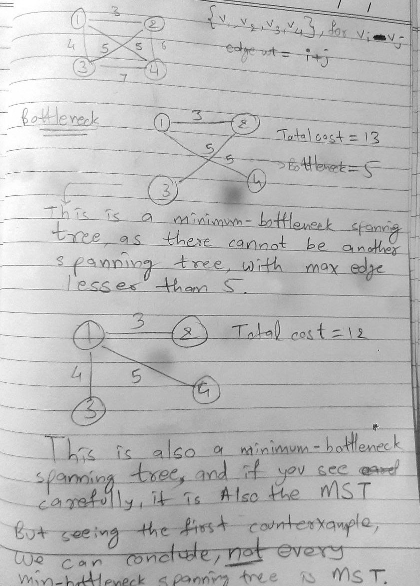

### Minimum-Bottleneck Spanning Tree
___
#### Module-2 Graded Assignment and Quiz Q-3

One of the basic motivations behind the Minimum Spanning Tree Problem is the goal of designing a spanning network for a set of nodes with minimum total cost. Here we explore another type of objective: designing a spanning network for which the most expensive edge is as cheap as possible.

Specifically, let $G$ be a connected graph with $n$ vertices, $m$ edges, and positive edge costs. Let $T$ be a spanning tree of $G$; we define the bottleneck edge of $T$ to be the edge of $T$ with the greatest cost.

A spanning tree $T$ of $G$ is a minimum-bottleneck spanning tree if there is no spanning tree $T'$ of $G$ with a cheaper bottleneck edge.

Answer the following:

1. Is every minimum-bottleneck tree of $G$ a minimum spanning tree of $G$? Prove or give a counterexample.
2. Is every minimum spanning tree of $G$ a minimum-bottleneck tree of $G$? Prove or give a counterexample.
3. Is (1) true? If yes, why? If no, what is a counterexample?
___

#### Answers

| 1. No   3. Counterexample below                                                                             | 
|----------------------------------------------------------------------------------------------------------------| 
|                        |
| 2. Yes. Obviously, MST chooses the minimum edges, it must be a minimum-bottleneck spanning tree in every case. |